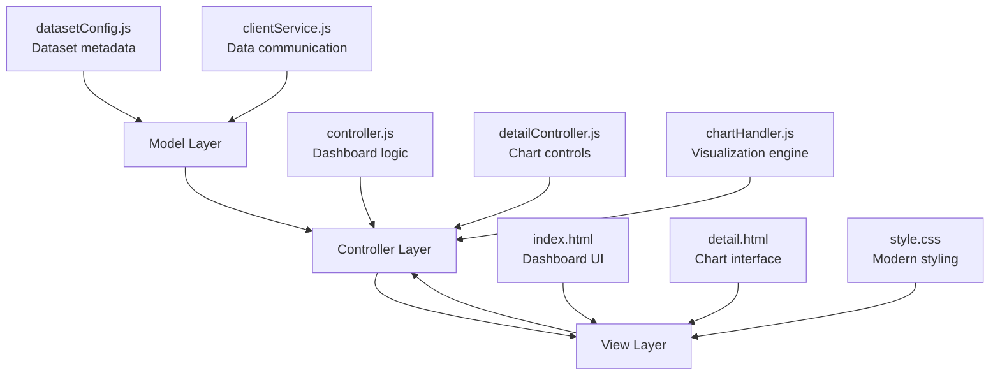

# 🌟 DataNAD - Portal Visualisasi Data Aceh

<div align="center">


**Portal data terpadu yang menyediakan akses mudah terhadap berbagai dataset resmi pemerintah untuk mendukung transparansi dan pengambilan keputusan berbasis data di wilayah Aceh**

[](https://github.com/mridho24/Visualisasi-Data-Aceh/stargazers)
[](https://github.com/mridho24/Visualisasi-Data-Aceh/network/members)

[📖 Dokumentasi](#dokumentasi) · [🐛 Laporkan Bug](https://github.com/mridho24/Visualisasi-Data-Aceh/issues) · [💡 Request Fitur](https://github.com/mridho24/Visualisasi-Data-Aceh/issues)

</div>

---

## 📋 Daftar Isi

- [🌟 Tentang Proyek](#-tentang-proyek)
- [✨ Fitur Utama](#-fitur-utama)
- [ Teknologi](#-teknologi)
- [🏗️ Arsitektur](#️-arsitektur)
- [📦 Instalasi](#-instalasi)
- [🔧 Penggunaan](#-penggunaan)
- [📊 Dataset](#-dataset)
- [🤝 Kontribusi](#-kontribusi)
- [👨‍💻 Penulis](#-penulis)

---

## 🌟 Tentang Proyek

**DataNAD (Data Nanggroe Aceh Darussalam)** adalah aplikasi web modern yang dirancang khusus untuk memvisualisasikan data statistik pemerintah Provinsi Aceh. Proyek ini dikembangkan sebagai bagian dari program **Kerja Kerja Praktik (KKP)** dengan tujuan meningkatkan transparansi data pemerintah dan memudahkan akses informasi publik.

### 🎯 Tujuan Proyek

- **Transparansi Data**: Menyediakan akses terbuka terhadap data pemerintah Aceh
- **Visualisasi Interaktif**: Mengubah data mentah menjadi grafik yang mudah dipahami
- **Pengambilan Keputusan**: Mendukung decision making berbasis data
- **Aksesibilitas**: Interface yang user-friendly dan responsive

---

## ✨ Fitur Utama

### 🔍 **Smart Search & Filter**

- 🔎 Pencarian real-time berdasarkan judul atau deskripsi
- 🏷️ Filter dataset berdasarkan kategori
- 💬 Placeholder dinamis dengan contoh pencarian

### 📊 **Visualisasi Data Canggih**

- 📈 **Auto-Detection**: Sistem otomatis menentukan jenis chart terbaik
- 🎨 **Multi-Chart Support**: Bar Chart, Line Chart, Pie Chart
- 🤖 **Smart Recommendations**: AI-powered column selection
- ⚡ **Real-time Updates**: Update chart tanpa refresh halaman

### 🧠 **Intelligent Data Analysis**

- 🔬 **Column Analysis**: Deteksi otomatis tipe data (numerik, kategori, tanggal)
- 📋 **Data Aggregation**: Pengelompokan data untuk dataset besar
- 💡 **Smart Suggestions**: Rekomendasi sumbu X dan Y terbaik
- 🛡️ **Error Handling**: Penanganan data yang tidak valid

### 🎨 **Modern UI/UX**

- 🌐 **Responsive Design**: Optimal di semua device
- 🎭 **Grid Background**: Design modern dan profesional
- ✨ **Smooth Animations**: Transisi halus dan hover effects
- 📱 **Mobile First**: Prioritas pengalaman mobile

---

##  Teknologi

### 🎯 **Frontend Technologies**

| Teknologi                                                                                                | Versi | Kegunaan                      |
| -------------------------------------------------------------------------------------------------------- | ----- | ----------------------------- |
|                 | HTML5 | Struktur markup semantic      |
|                    | CSS3  | Styling dengan Grid & Flexbox |
|  | ES6+  | Logic dan interaktivitas      |
|        | 4.x   | Library visualisasi data      |

### 🏗️ **Architecture & Patterns**

- **📐 MVC Pattern**: Model-View-Controller architecture
- **🧩 ES6 Modules**: Modular JavaScript structure
- **🔄 Event-Driven**: Responsive user interactions
- **🎨 Component-Based**: Reusable UI components

### 🛠️ **Development Tools**

- **💻 VS Code**: Primary IDE
- **🔧 Git**: Version control
- **🌐 GitHub**: Repository hosting
- **🔍 Browser DevTools**: Debugging dan testing

---

## 🏗️ Arsitektur

### 📂 Struktur Proyek

```
aceh-data-visualisasi/
├── 📁 css/
│   └── 📄 style.css          # Styling utama dengan grid theme
├── 📁 js/
│   ├── 📄 controller.js      # Main controller (dashboard)
│   ├── 📄 detailController.js # Detail page controller
│   ├── 📄 chartHandler.js    # Chart rendering logic
│   ├── 📄 clientService.js   # Data communication
│   └── 📄 datasetConfig.js   # Dataset configuration
├── 📁 lib/
│   └── 📄 chart.js          # Chart.js library
├── 📄 index.html            # Main dashboard page
├── 📄 detail.html           # Chart visualization page
├── 📄 .gitignore           # Git ignore rules
└── 📄 README.md            # Project documentation
```

### 🔄 MVC Architecture



---

## 📦 Instalasi

### 📋 Prerequisites

- 🌐 **Web Browser** modern (Chrome, Firefox, Safari, Edge)
- 🌍 **Internet Connection** untuk mengakses data
- 📝 **Text Editor** (VS Code recommended)

### 🚀 Quick Start

1. **📥 Clone Repository**

   ```bash
   git clone https://github.com/mridho24/Visualisasi-Data-Aceh.git
   cd Visualisasi-Data-Aceh
   ```

2. **🌐 Buka di Browser**

   ```bash
   # Opsi 1: Buka langsung file
   open index.html

   # Opsi 2: Menggunakan Live Server (recommended)
   # Install Live Server extension di VS Code
   # Klik kanan pada index.html → "Open with Live Server"
   ```

3. **🚀 Akses Aplikasi**
   - Dashboard: `http://localhost:5500/index.html`
   - Detail: `http://localhost:5500/detail.html?id=dayah`

### 🔧 Development Setup

```bash
# Clone dan masuk ke directory
git clone https://github.com/mridho24/Visualisasi-Data-Aceh.git
cd Visualisasi-Data-Aceh

# Buka di VS Code
code .

# Install Live Server extension untuk development
# Extension ID: ritwickdey.liveserver
```

---

## 🔧 Penggunaan

### 🏠 **Dashboard (index.html)**

1. **🔍 Pencarian Dataset**

   - Gunakan search bar untuk mencari dataset
   - Placeholder akan berubah otomatis dengan contoh pencarian
   - Filter real-time berdasarkan judul atau deskripsi

2. **📋 Eksplorasi Dataset**
   - Browse kartu dataset yang tersedia
   - Lihat preview data pada setiap kartu
   - Klik "Lihat Detail" untuk visualisasi

### 📊 **Halaman Detail (detail.html)**

1. **🎛️ Kontrol Visualisasi**

   ```javascript
   // Pilihan sumbu X dan Y
   xColumn: "nama_kabupaten_kota"; // Sumbu horizontal
   yColumn: "jumlah_dayah"; // Sumbu vertikal

   // Jenis chart
   chartType: "auto" | "bar" | "line" | "pie";
   ```

2. **🔄 Mode Tampilan**

   - **📊 Chart View**: Visualisasi interaktif
   - **📋 Table View**: Data dalam bentuk tabel

3. **⚙️ Fitur Lanjutan**
   - Auto-recommendation untuk kolom terbaik
   - Real-time chart updates
   - Responsive chart sizing

---

## 📊 Dataset

### 📈 Dataset yang Tersedia

| Dataset                        | ID         | Deskripsi                        | Visualisasi Terbaik      |
| ------------------------------ | ---------- | -------------------------------- | ------------------------ |
| 🕌 **Jumlah Dayah**            | `dayah`    | Lembaga pendidikan Islam di Aceh | Pie Chart (regional)     |
| 🎓 **Angka Partisipasi Kasar** | `apk`      | Data pendidikan 2017-2024        | Line Chart (time series) |
| 🔬 **Alat Uji dan Kalibrasi**  | `alat-uji` | Data RMC 2017-2024               | Bar Chart (comparison)   |

---

## 🤝 Kontribusi

Kami sangat menghargai kontribusi dari komunitas! 🎉

### 🚀 Cara Berkontribusi

1. **🍴 Fork Repository**

   ```bash
   # Fork melalui GitHub UI atau
   gh repo fork mridho24/Visualisasi-Data-Aceh
   ```

2. **🌿 Buat Branch Fitur**

   ```bash
   git checkout -b feature/nama-fitur-anda
   ```

3. **💻 Implementasi**

   - Tulis kode dengan clean dan documented
   - Follow existing code style
   - Test pada berbagai browser

4. **📝 Commit Changes**

   ```bash
   git add .
   git commit -m "feat: tambah fitur visualisasi histogram"
   ```

5. **📤 Push & Pull Request**
   ```bash
   git push origin feature/nama-fitur-anda
   # Buat PR melalui GitHub UI
   ```

### 💡 Ide Kontribusi

- 🎨 **UI/UX Improvements**: Design enhancements
- 📊 **New Chart Types**: Histogram, Scatter plot, etc.
- 🔍 **Advanced Filters**: Date range, category filters
- 📱 **Mobile Optimization**: Touch gestures, PWA
- 🌐 **Internationalization**: Multi-language support
- ⚡ **Performance**: Optimization untuk dataset besar

### 🐛 Bug Reports

Gunakan [GitHub Issues](https://github.com/mridho24/Visualisasi-Data-Aceh/issues) dengan template:

```markdown
**🐛 Bug Description**
Deskripsi singkat tentang bug

**🔄 Steps to Reproduce**

1. Buka halaman...
2. Klik pada...
3. Error muncul...

**💻 Environment**

- Browser: Chrome 98
- OS: Windows 11
- Screen: 1920x1080
```

---

## ‍💻 Penulis

<div align="center">

### 🚀 Muhammad Ridho

[](https://www.linkedin.com/in/muhammad-ridho-a3517b309/)
[](https://www.instagram.com/mmrdhoo/?next=%2F)
[](mailto:muhammadridhor24@gmail.com)
[](https://github.com/mridho24)

**🎓 Mahasiswa Teknik Informatika**  
**📍 Banda Aceh, Indonesia**  
**💼 KKP Project 2025**

</div>

### 🙏 Acknowledgments

- **🏛️ Pemerintah Provinsi Aceh** - Penyedia data pemerintah
- **📊 Chart.js Community** - Amazing visualization library
- **🎨 Design Inspiration** - Modern web design trends
- **👥 Open Source Community** - Continuous learning and support

---

<div align="center">

### ⭐ Jika proyek ini bermanfaat, jangan lupa berikan Star!

**Made with ❤️ by Muhammad Ridho**

[](https://github.com/mridho24/Visualisasi-Data-Aceh/stargazers)

---

_© 2025 DataNAD. Portal Data Nanggroe Aceh Darussalam. All rights reserved._

</div>
